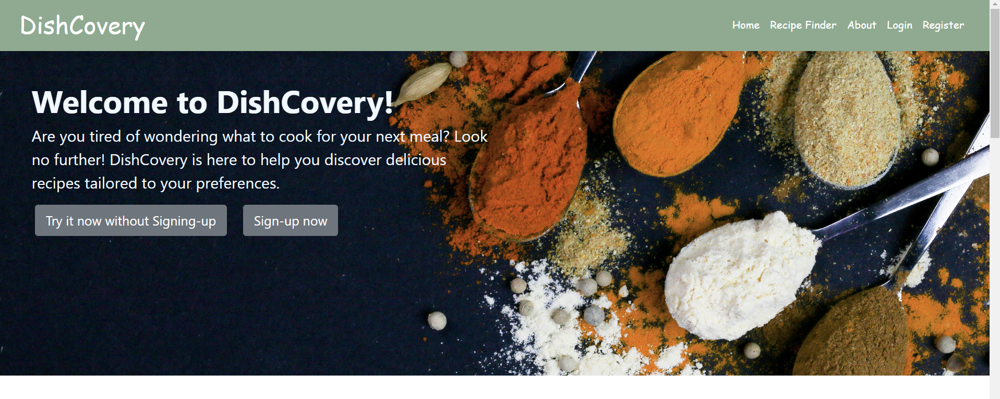

<a name="readme-top"></a>

<div align="center">
  <!-- You are encouraged to replace this logo with your own! Otherwise you can also remove it. -->
  
  <br/>
</div>


<!-- TABLE OF CONTENTS -->

# 📗 Table of Contents

- [📖 About the Project](#about-project)
  - [🛠 Built With](#built-with)
    - [Tech Stack](#tech-stack)
    - [Key Features](#key-features)
  - [🚀 Live Demo](#live-demo)
- [💻 Getting Started](#getting-started)
  - [Prerequisites](#prerequisites)
  - [Setup](#setup)
  - [Usage](#usage)
- [👥 Authors](#authors)
- [🤝 Contributing](#contributing)
- [⭐️ Show your support](#support)
- [🙏 Acknowledgements](#acknowledgements)
- [📝 License](#license)

<!-- PROJECT DESCRIPTION -->

# 📖 DishCovery Recipe Finder <a name="about-project"></a>

This web application allows users to search for recipes based on their existing ingredients or desired cuisine, meal type, and more. By leveraging the Edamame Recipe API, the application provides a vast database of recipes to suit any preference. With features like user accounts and recipe bookmarking, this recipe finder is the perfect companion for home cooks of all levels.

This recipe finder application is a web-based solution built with a combination of front-end and back-end technologies. The front-end utilizes HTML5 for structure and content, CSS3 for styling, and Javascript with jQuery to deliver an interactive user experience. On the back-end, Flask, a Python web framework, handles server-side logic and API calls. The application leverages the Edamame Recipe API to access a vast recipe database.

The web app was hosted on a private server from ALX Africa and is currently not maintained and is down. However, we plan to host the application again and add some improvements!


## 🛠 Built With <a name="built-with"></a>

### Tech Stack <a name="tech-stack"></a>

<details>
  <summary>Client</summary>
  <ul>
    <li><a href="">HTML</a></li>
    <li><a href="">CSS</a></li>
    <li><a href="">JAVASCRIPT</a></li>
    <li><a href="">JQUERY</a></li>
  </ul>
</details>

<details>
  <summary>Server</summary>
  <ul>
    <li><a href="https://flask.palletsprojects.com/en/3.0.x/">FLASK</a></li>
    <li><a href="https://www.python.org/">PYTHON</a></li>
    <li><a href="https://www.sqlalchemy.org/">SQLALCHEMY</a></li>
  </ul>
</details>

<details>
<summary>Database</summary>
  <ul>
    <li><a href="https://https://www.mysql.com/">MySQL</a></li>
  </ul>
</details>

<!-- Features -->


### Key Features <a name="key-features"></a>

- Authentication
- Search recipes
- Settings profile
- Add bookmark
- Remove bookmark
- Register

<p align="right">(<a href="#readme-top">back to top</a>)</p>


<!-- LIVE DEMO -->

## 🚀 Live Demo <a name="live-demo"></a>

The app is deployed [here](https://dishcovery-six.vercel.app/) with no login features and user data storage on Vercel. The user data storage will be added soon, with some UI improvements and pagination added to provide more recipe results.

- You can see the full feature video demo [here](https://www.youtube.com/watch?v=1abO6UxFAn4&ab_channel=NebiyouSeifu).

<p align="right">(<a href="#readme-top">back to top</a>)</p>


<!-- GETTING STARTED -->

## 💻 Getting Started <a name="getting-started"></a>

To get a local copy up and running, follow these steps.


### Prerequisites

To run this project you need:

- Install prerequisite modules using requirements.txt
```bash
pip install -r requirements.txt
```


### Setup

Clone this repository to your desired folder:

```bash
git clone https://github.com/NebiyouBelaineh/Dishcovery
```


### Get your own API Keys from EDAMAM

Edamam has a free API KEY for developers. Sign up for Edamam API and get an API KEY and API ID from [here](https://developer.edamam.com/edamam-recipe-api).


### 🔐 Setup Environment Variables

To run this project, you will need to add the `API KEY` and `API ID` to your `.env` along with the other Environment Variables to your `.env` file as shown below:
```bash
API_KEY=YOUR_EDAMAM_API_KEY
API_ID=YOUR_EDAMAM_API_ID

DISHCOVERY_MYSQL_USER='dishcovery_dev'
DISHCOVERY_MYSQL_PWD='dishcovery_dev_pwd'
DISHCOVERY_MYSQL_HOST='localhost'
DISHCOVERY_MYSQL_DB='dishcovery_dev_db'
DISHCOVERY_ENV='db'
```
For the secret key to keep the forms secure, you can use either of the two methods:
- Using a random secret key every time (more secure)
  ```python
  import os

  default_secret_key = os.urandom(24)
  app.config["SECRET_KEY"] = default_secret_key
  ```
- Creating and storing a secret key in the `DISHCOVERY_SECRET_KEY` environment variable.
  ```bash
  DISHCOVERY_SECRET_KEY=YOUR_SECRET_KEY
  ```
  ```python
  app.config['SECRET_KEY'] = os.getenv('DISHCOVERY_SECRET_KEY')
  ```

### Usage

To start the application, go to the project root folder and run:

```bash
python3 app.py
```
The application will be started on localhost port 5000.


<p align="right">(<a href="#readme-top">back to top</a>)</p>

<!-- AUTHORS -->

## 👥 Authors <a name="authors"></a>

👤 **Nebiyou Belaineh**

- GitHub: [@githubhandle](https://github.com/NebiyouBelaineh)
- Twitter: [@twitterhandle](https://twitter.com/SeifuNebiyou)
- LinkedIn: [LinkedIn](https://www.linkedin.com/in/nebiyou-belaineh-2a683415b/)

👤 **Dridi Chaith**

- GitHub: [@githubhandle](https://github.com/sethgreen23)
- Twitter: [@twitterhandle](https://twitter.com/dridi_chaith)
- LinkedIn: [LinkedIn](https://www.linkedin.com/in/chaith-dridi/)

<p align="right">(<a href="#readme-top">back to top</a>)</p>

<!-- CONTRIBUTING -->

## 🤝 Contributing <a name="contributing"></a>

Contributions are always welcome!

Email: [Nebiyou](nebiyouseifu2@gmail.com) or [Chaith](dridi.seth31@gmail.com)  for ways to get started.

<p align="right">(<a href="#readme-top">back to top</a>)</p>

<!-- SUPPORT -->

## ⭐️ Show your support <a name="support"></a>

If you like this project, ⭐ to the repo will be appreciated.

<p align="right">(<a href="#readme-top">back to top</a>)</p>

## 🙏Acknowledgements

We would like to thank the authors of the resource and acknowledge that we have used the following in our project:

- [Flask documentation](https://flask.palletsprojects.com/en/3.0.x/)
- [Python documentation](https://www.python.org/)
- [JQuery documentation](https://api.jquery.com/)
- [Javascript, HTML, CSS documentation](https://developer.mozilla.org/fr/)
- [W3schools](https://www.w3schools.com/)
- [SQLALCHEMY](https://www.sqlalchemy.org/)

<p align="right">(<a href="#readme-top">back to top</a>)</p>
<!-- LICENSE -->

## 📝 License <a name="license"></a>

This project is [MIT](./LICENSE) licensed.

<p align="right">(<a href="#readme-top">back to top</a>)</p>
